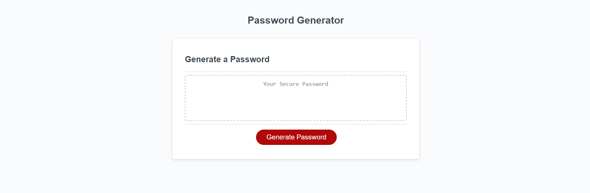
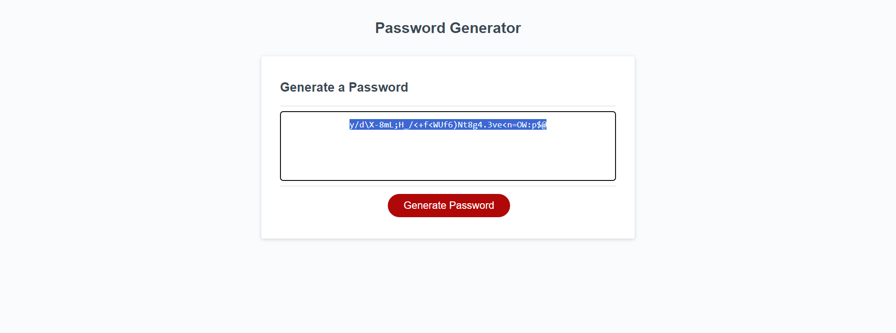

# Password generator
(You can access our deployed website here: https://honguyen00.github.io/password-generator/)

## Description

The aim of this project is to have a website that can generate a custom and secured password based on users's input.

By having users select a valid length of their new password together with what types of letters to be included, the website will generate and display the new password for users to copy.

## Installation

N/A

## Usage
This is the overall look of the website  

After you click the "Generate password" button and answer all the prompts with valid answers, your new password will be displayed.

